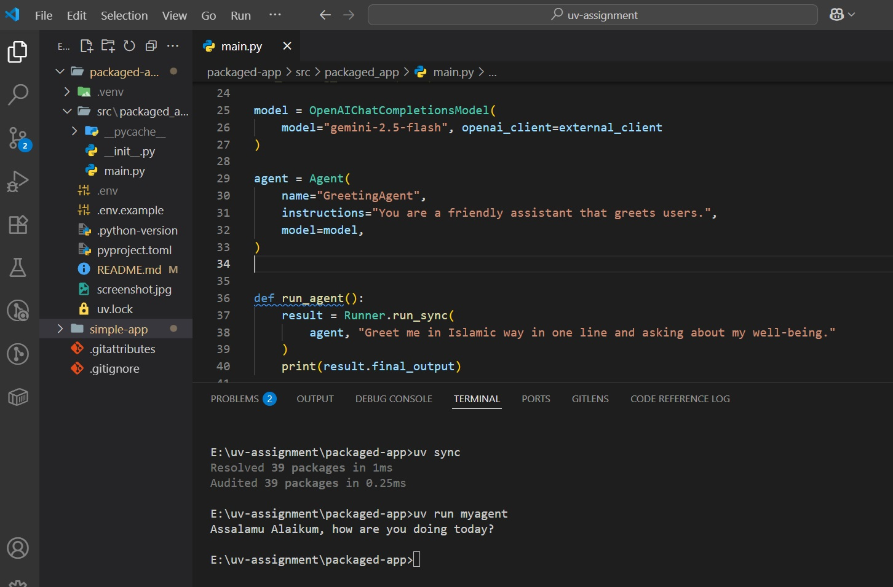

# Packaged App

A professionally packaged Python application that uses AI agents to generate Islamic greetings using Google's Gemini model. This version demonstrates proper Python packaging with entry points and modular structure.

## Features

- AI-powered greeting generation using Gemini 2.5 Flash model
- Islamic greeting responses with well-being inquiries
- Professional Python package structure
- Multiple entry points for different use cases
- Environment-based API key configuration
- Command-line interface with custom commands

## Prerequisites

- Python 3.13+
- [uv](https://docs.astral.sh/uv/) package manager
- Google Gemini API key

## Installation

1. **Clone the repository** (if not already done):
   ```bash
   git clone <repository-url>
   cd uv-assignment/packaged-app
   ```

2. **Install dependencies**:
   ```bash
   uv sync
   ```

3. **Set up environment variables**:
   ```bash
   cp .env.example .env
   ```
   
   Edit `.env` file and add your Gemini API key:
   ```
   GEMINI_API_KEY=your_actual_api_key_here
   ```

## Getting Your Gemini API Key

1. Go to [Google AI Studio](https://aistudio.google.com/app/apikey)
2. Sign in with your Google account
3. Click "Create API Key"
4. Copy the generated API key
5. Paste it in your `.env` file

## Usage

### Method 1: Using the main entry point
```bash
uv run myagent
```

### Method 2: Using the package entry point
```bash
uv run packaged-app
```

### Method 3: Direct module execution
```bash
uv run python -m packaged_app.main
```

All methods will:
1. Load your API key from the `.env` file
2. Initialize the Gemini AI model
3. Generate an Islamic greeting with well-being inquiry
4. Display the response

## Project Structure

```
packaged-app/
├── src/
│   └── packaged_app/
│       ├── __init__.py      # Package initialization
│       └── main.py          # Main application logic
├── pyproject.toml           # Project configuration and dependencies
├── .env.example             # Environment variables template
├── .env                     # Your environment variables (not in git)
├── README.md                # This file
├── screenshot.jpg           # Sample output screenshot
└── uv.lock                 # Dependency lock file
```

## Entry Points

This package defines two entry points in `pyproject.toml`:

1. **`packaged-app`** - Main package entry point
2. **`myagent`** - Direct function entry point to `run_agent()`

## Dependencies

- `openai-agents>=0.2.11` - AI agent framework with OpenAI compatibility
- `python-dotenv` - Environment variable management (included in openai-agents)

## Sample Output



The application generates responses like:
```
Assalamu Alaikum! May Allah bless you with peace and good health - how are you doing today?
```

## Development

### Building the Package

To build the package for distribution:
```bash
uv build
```

This creates distribution files in the `dist/` directory.

### Installing in Development Mode

For development with editable installation:
```bash
uv pip install -e .
```

### Running Tests

If you add tests in the future:
```bash
uv run pytest
```

## Package Configuration

The `pyproject.toml` file defines:
- **Build system**: `uv_build` backend
- **Entry points**: Custom commands for easy execution
- **Dependencies**: Required packages
- **Metadata**: Author, version, description

## Troubleshooting

**Error: "GEMINI_API_KEY is missing"**
- Ensure your `.env` file exists and contains the API key
- Verify the API key is valid and active

**Error: "Module not found"**
- Run `uv sync` to install dependencies
- Ensure you're using Python 3.13+
- Check that the package structure is correct

**Entry point not working**
- Verify the entry points are correctly defined in `pyproject.toml`
- Try reinstalling: `uv sync --reinstall`

**API Connection Issues**
- Check your internet connection
- Verify your Gemini API key is valid
- Ensure you haven't exceeded API rate limits

## Configuration

The app uses the following configuration:
- **Model**: `gemini-2.5-flash`
- **Base URL**: `https://generativelanguage.googleapis.com/v1beta/openai`
- **Agent Name**: `GreetingAgent`
- **Instructions**: Friendly assistant that greets users

## Advantages of Packaged Version

1. **Professional Structure**: Follows Python packaging best practices
2. **Multiple Entry Points**: Different ways to run the application
3. **Modular Design**: Separates logic into functions for reusability
4. **Distribution Ready**: Can be built and distributed as a wheel
5. **Import Friendly**: Can be imported as a module in other projects

## License

This project is for educational/demonstration purposes.