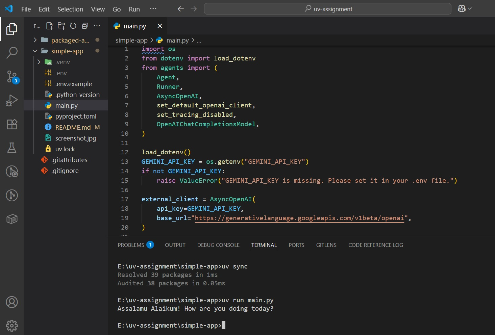

# Simple App

A Python application that uses AI agents to generate Islamic greetings using Google's Gemini model through OpenAI-compatible API.

## Features

- AI-powered greeting generation using Gemini 2.5 Flash model
- Islamic greeting responses with well-being inquiries
- Environment-based API key configuration
- Simple command-line interface

## Prerequisites

- Python 3.13+
- [uv](https://docs.astral.sh/uv/) package manager
- Google Gemini API key

## Installation

1. **Clone the repository** (if not already done):
   ```bash
   git clone <repository-url>
   cd uv-assignment/simple-app
   ```

2. **Install dependencies**:
   ```bash
   uv sync
   ```

3. **Set up environment variables**:
   ```bash
   cp .env.example .env
   ```
   
   Edit `.env` file and add your Gemini API key:
   ```
   GEMINI_API_KEY=your_actual_api_key_here
   ```

## Getting Your Gemini API Key

1. Go to [Google AI Studio](https://aistudio.google.com/app/apikey)
2. Sign in with your Google account
3. Click "Create API Key"
4. Copy the generated API key
5. Paste it in your `.env` file

## Usage

Run the application:
```bash
uv run main.py
```

The app will:
1. Load your API key from the `.env` file
2. Initialize the Gemini AI model
3. Generate an Islamic greeting with well-being inquiry
4. Display the response

## Project Structure

```
simple-app/
├── main.py           # Main application file
├── pyproject.toml    # Project configuration and dependencies
├── .env.example      # Environment variables template
├── .env              # Your environment variables (not in git)
├── README.md         # This file
├── screenshot.jpg    # Sample output screenshot
└── uv.lock          # Dependency lock file
```

## Dependencies

- `openai-agents>=0.2.11` - AI agent framework with OpenAI compatibility
- `python-dotenv` - Environment variable management (included in openai-agents)

## Sample Output



The application generates responses like:
```
Assalamu Alaikum! May Allah bless you with peace and good health - how are you doing today?
```

## Troubleshooting

**Error: "GEMINI_API_KEY is missing"**
- Ensure your `.env` file exists and contains the API key
- Verify the API key is valid and active

**Error: "Module not found"**
- Run `uv sync` to install dependencies
- Ensure you're using Python 3.13+

**API Connection Issues**
- Check your internet connection
- Verify your Gemini API key is valid
- Ensure you haven't exceeded API rate limits

## Configuration

The app uses the following configuration:
- **Model**: `gemini-2.5-flash`
- **Base URL**: `https://generativelanguage.googleapis.com/v1beta/openai`
- **Agent Name**: `GreetingAgent`
- **Instructions**: Friendly assistant that greets users

## License

This project is for educational/demonstration purposes.